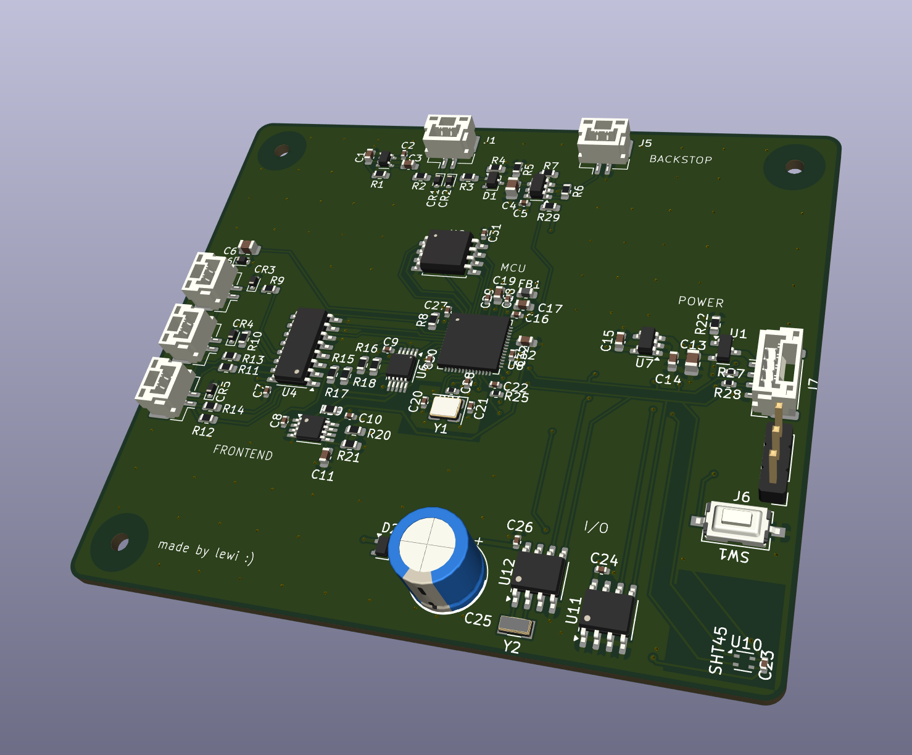

# leakwatch

A multi-channel leak sensor for equipment enclosures. Instead of reporting
"wet / dry" like a normal leak probe, it measures **how** wet each enclosure is,
on a separate channel per enclosure, and carries a second circuit that raises an
alarm in hardware with no firmware involved.

Designed with the [Blue Robotics](https://bluerobotics.com/) BlueROV2 in mind —
a Navigator flight controller, I²C, and JST-GH connectors. The
circuit itself is generic and would suit any multi-enclosure system.

Design study. Ninety parts, five schematic sheets, four-layer board. Simulated
and netlist-validated. **Never built** — see [Open items](#open-items).


*3D View*

---

## Early note

This was my **first mixed-signal PCB layout** and my first time using LTspice.
Both show. 

---

## The problem

Commercial leak probes are threshold devices — they answer wet or dry and nothing
more. That limitation is physical, not a design shortcut:

**You can't measure water with DC.** Apply a steady voltage across two electrodes
in water and ions pile up on each surface within milliseconds. The reading drifts,
and the net DC current slowly dissolves the electrodes.

**So you use AC. But no single frequency works.**

```
   LOW frequency   →  the layer of ions on each electrode blocks you
   HIGH frequency  →  the probe cable's own capacitance shunts around
                      the water, and a dry probe reads as flooded
   usable window   →  a few hundred Hz to a few tens of kHz — and the
                      window MOVES depending on how wet the probe is
```

A second problem, which is why this board has three channels: systems with
several enclosures commonly combine their leak sensors into a single alarm bit.
You learn something is wet. You don't learn which thing.

A stock BlueROV2 has two watertight enclosures — a 4" electronics tube (the
camera lives inside it) and a 3" battery tube — and operators often add a payload
tube. ArduSub supports three leak detector instances, which is why this board has
three channels. A flooded battery is a power loss and a lithium hazard; a flooded
electronics tube is a lost vehicle. Right now both raise the same alarm.

It's also worth being clear about what already exists: every BlueROV2 ships with
a hand vacuum pump, and pulling ~15 inHg and watching it for 10–15 minutes is a
genuinely good pre-dive seal check. But the vacuum is released before the vehicle
enters the water, so nothing monitors the seal during the dive. **This board
addresses the second gap, not the first.**

---

## How it works

Two independent paths.

```
   probe 1 ──┐
   probe 2 ──┼──► FRONT END ──────► MCU ────► I²C to the host
   probe 3 ──┘    mux, amplifier,   measures,
                  4 gain ranges     logs, reports

   probe 4 ─────► BACKSTOP ─────────────────► alarm line
                  oscillator, peak            (no firmware
                  detector, comparator         in the path)
```

### The front end

**Excitation.** A microcontroller pin swings 0–3.3 V at 10 Hz, 1 kHz or 20 kHz.
A 100 Ω resistor softens the edges so the trace doesn't radiate across the board.
A 10 µF capacitor in series guarantees zero average current through the water —
a capacitor physically cannot pass DC, so the electrodes can't corrode.

**Probe interface.** Three connectors, one per enclosure. Every wire leaving the
board gets a TVS clamp for static protection and a 100 Ω series resistor.

**Calibration channels.** Three of the multiplexer's inputs go to on-board
resistors instead of probes — 100 Ω, 1 kΩ and 1 MΩ. Measuring a known resistor
with the same circuit tells you what the circuit itself contributes, so you can
subtract it. These are the reason the numbers mean anything.

**Multiplexer.** An 8:1 switch selects one probe or one calibration reference at
a time. This is what preserves per-enclosure identity.

**Transimpedance amplifier.** The important part. A naive measurement — sense
resistor to ground — lets the probe cable steal the signal, because the measuring
point moves and the cable charges and discharges following it.

The amplifier instead **holds that point perfectly still**, pushing back exactly
hard enough to keep it from moving. A node that never moves can't charge the
cable, so the cable steals nothing. The amount of push-back is the measurement.

In simulation this moved the highest usable frequency from about 1 kHz to about
100 kHz — roughly 100×, and it's what makes the three-frequency scheme possible
at all.

**Four gain ranges.** A flooded probe and a dry probe differ by about 10,000:1.
No single amplifier setting reads both, so there are four and firmware picks the
one that keeps the reading on scale.

**VMID.** The board has 0 V and 3.3 V and no negative rail, but the signal needs
to swing both ways. So the circuit redefines zero as 1.65 V — a resistor divider
buffered by an op-amp. Everything is referenced to that.

### The backstop

A completely separate circuit sharing only the ground plane and the 5 V rail.

```
  Schmitt oscillator ──► DC block ──► probe ──► divider ──► peak detector ──► comparator
      ~4.5 kHz                                   3.3 kΩ                        TLV3011
```

A Schmitt-trigger inverter with one resistor and one capacitor oscillates at
about 4.5 kHz whenever it has power — no clock, no configuration, nothing to
program. A divider turns "how wet" into a voltage, a diode and capacitor turn AC
into DC, and a comparator with hysteresis trips at about 2.3 kΩ of probe
resistance.

It runs from 5 V, upstream of the 3.3 V regulator. If that regulator fails, the
microcontroller dies but the backstop keeps working and can still assert the
alarm.

The microcontroller can *watch* the alarm line to log it. It can't override it.

---

## Board

| | |
|---|---|
| Layers | 4 (signal / ground / power / signal), 1.6 mm |
| Size | 75.0 × 65.0 mm |
| JLC04161H-7628 Stackup |

The board was routed using KiCad, and the files can be viewed in /pcb. 
v1 was made under sleep deprivation. v2 is a more thoughtfully routed board, taking into account proper rule zones,
more carefully arranged components, and stricter adherence to the seperation between digital and analog zones.

---

## Open items

This has never been built or tested. The full list is in
[DESIGN.md](DESIGN.md#13-open-items); the ones that matter most:

| Item | Status |
|---|---|
| Never fabricated | The largest caveat |
| Amplifier compensation on the two high gain ranges | One fixed feedback capacitor can't serve four decades of gain. Needs one per range. Found reviewing my own work; not fixed |
| A broken probe wire reads as "dry" | Nothing distinguishes dry from disconnected. Fix identified — a 10 MΩ across the electrodes at the probe end makes "open" detectable — not implemented |
| Anti-alias filter vs. ADC sample rate | The corner frequency was never chosen against an actual sample rate |
| Electrode material and geometry | Unspecified, and it's what sets the values the whole frequency analysis rests on |
| Interference from nearby motor drives | Not analysed |

---

## What I learned

The thing I'd tell myself at the start: **almost every component was a
countermeasure to a specific physical problem, and I didn't know what most of
those problems were until I'd already drawn the circuit wrong once.**

Concretely:

- Simulating before drawing schematics would have saved weeks. The frequency
  window result reshaped the entire architecture, and I found it in LTspice, not
  on paper.
- Generating the netlist from a single validated source file was the best
  decision in the project. It caught real errors the moment I merged two sheets —
  including two nets that were secretly the same node.
- Validation catches *topology*, not *intent*. I once changed a supply rail from
  5 V to 3.3 V by accident; every pin was still connected, the checker was happy,
  and the error only surfaced when the arithmetic downstream stopped making sense.
- Splitting a ground plane to "isolate" analog from digital is the intuitive move
  and the wrong one.

---

## Repository

```
  /schematics     KiCad schematics, 5 sheets, plus PDFs
  /pcb            KiCad layout, 4 layers, renders
  /sim            LTspice files for the front end and backstop
  /netlist        design.py — single source of truth, validates the netlist
  DESIGN.md       full design document, every decision and why
```

---

## References, and where the numbers came from

I've tried to be exact about which values are sourced and which are assumptions.
Several are assumptions.

### Electrochemistry

| Quantity | Value used | Source |
|---|---|---|
| Equivalent circuit model | Randles cell (solution resistance in series with a parallel double-layer capacitance and charge-transfer resistance) | Randles, J.E.B., *Kinetics of rapid electrode reactions*, Discussions of the Faraday Society, vol. 1, 1947. Modern summary: [Gamry, *Basics of EIS*](https://www.gamry.com/application-notes/EIS/basics-of-electrochemical-impedance-spectroscopy/) |
| Double-layer capacitance | 0.5 µF per electrode | Derived, not measured. Gamry gives **20–60 µF/cm²** for a metal–electrolyte interface. 0.5 µF therefore implies roughly **1 mm² of wetted electrode area**. A realistic probe with larger pads would have a considerably higher Cdl, which shifts the low-frequency limit — see Open items |
| Charge-transfer resistance | 100 kΩ | **Order-of-magnitude placeholder. Not sourced.** It depends on electrode material, surface condition and water chemistry, none of which are specified in this design |

### Cable

| Quantity | Value used | Source |
|---|---|---|
| Probe cable capacitance | 200 pF | Estimate. [TI, *A Practical Guide to Cable Selection* (SNLA164)](https://www.ti.com/lit/an/snla164/snla164.pdf) cites **12–16 pF/ft (≈39–52 pF/m)** mutual capacitance for low-capacitance twisted pair. 200 pF corresponds to roughly a 4 m run, or less for ordinary PVC-insulated pairs. **Assumption, not a measurement of a specific cable** |


### Simulated results

These came from my own LTspice work, and the files are in `/sim` so you can
re-run them:

| Result | Where |
|---|---|
| Cable capacitance sets the high-frequency limit | cable_ceiling |
| Transimpedance topology removes it (≈100× improvement) | divider_vs_tia |
| Electrode layer sets the low-frequency limit | electrode_floor |
| The combined usable frequency window | probe_circuit |

Simulated with an **idealised op-amp**, so the limits shown are the probe's and
the cable's rather than the amplifier's. With the real OPA2333 (350 kHz
gain-bandwidth) the amplifier becomes a limit of its own on the high gain
ranges — that's Open item 2.

---

## How this was made

This project was a way to further my experience with ECAD, as well as learn how analog design decisions get made.

The schematic capture, the PCB layout and the LTspice work are mine, and that's
where most of the hours went. Ninety parts across five sheets, a four-layer
mixed-signal board, and every simulation in `/sim` run and re-run by me. It was
my first mixed-signal layout and I did most of it twice.

**The design decisions were largely not mine**, and I feel that I should be honest about that. I worked through this with
**Claude (Anthropic)**, which proposed the architecture - the three-tone
excitation scheme, the transimpedance front end, the switched gain ranges, the 
calibration channels, and the backstop - recommended the component families, 
wrote the LTspice exercises I learned to simulate from, 
and wrote this documentation.


I haven't taken the advanced analog electronics sequence yet, but I feel that this was a good start into analog design.
I'd do a good deal of this differently now, which is more or less the point of having done it.

Also thank you to **[Altium Academy](https://www.youtube.com/@AltiumAcademy)**, whose
mixed-signal layout videos were very helpful, and to the **KiCad** project, whose libraries 
saved me a lot of effort importing components.

